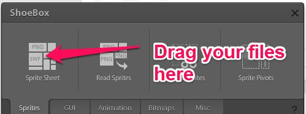

## Your first Sprite

T.R.P. does not use images directly. It uses atlas (= spriteSheets) to optimize drawings.
The recommended tool to create spritesheets is Shoebox.
Drag your images into shoebox

\

Shoebox will create 2 files for you.

* sheet.png : contains all your images into one big spritesheet
* sheet.xml : an xml file containing the location of each of your files.

Let's see an example of xml file produced by ShoeBox

    <TextureAtlas imagePath="sheet.png">
        <SubTexture name="Bullet.png" x="0" y="116" width="28" height="9"/>
        <SubTexture name="Player.png" x="0" y="74" width="39" height="40"/>
        <SubTexture name="Pointer.png" x="41" y="74" width="22" height="31"/>
        <SubTexture name="Seeker.png" x="0" y="0" width="40" height="30"/>
        <SubTexture name="Wanderer.png" x="0" y="32" width="40" height="40"/>
    </TextureAtlas>

You can see that the name of your images stay the same, but now each image has coordinates into the big spritesheet.

Thus to load your image into T.R.P. this is a 2 steps process

* Load the Atlas (= the spritesheet)
 
* Load the sprite 

1. Load the Atlas

~~~~ { .Cpp }

    Atlas atlas;
    atlas.Load("sheet"); //without extension because trp will read both the xml and image file
    
~~~~

2. Load the sprite

~~~~ { .Cpp }

    Sprite mySprite;
    mySprite.Load(atlas,"Player.png"); // atlas is the preloaded atlas, the 2nd param is the original name of your image file.

~~~~

Here's the minimal sample for sprites

~~~~ { .Cpp }

    class SpriteScene:Scene
        {
        Sprite mySprite;
        Atlas  myAtlas;

        void Init()
            {
            myAtlas.Load("graphics/sheet");         
            mySprite.Load(myAtlas,"sheep.png");
            mySprite.SetPosition(windowX/2,windowY/2);
            }
            
        void OnUpdate(uint64 _delta)
            {   
            
            }

        void OnRender(uint64 _delta)
            {
            WND_ClearWithColor(80,80,80,255);
            mySprite.Render(); 
            }

        void OnShutdown()
            {
            myAtlas.UnLoad();
            }
            
        }

~~~~ 

Of course, this is a minimal sample, you can do a lot more with sprites, 
Please take a look at the reference documentation for sprites

[Sprite](#class-sprite)

 

